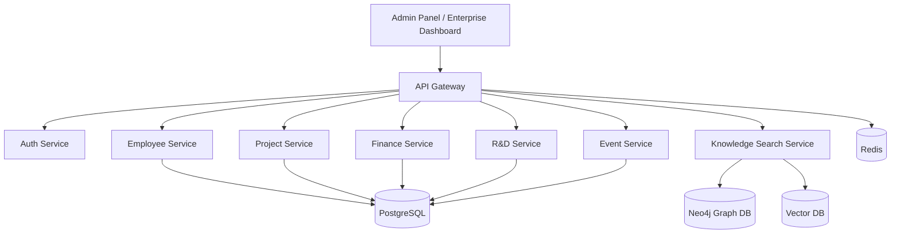

# Enterprise Brain

## 0. Project Motive and Solution

Enterprise Brain is an enterprise-grade intelligence and analytics platform designed to unify employee, project, financial, research, operational, and AI-driven business insights into a single scalable ecosystem.

The primary objective of this system is to answer strategic business questions such as:

- How much revenue is each employee contributing?
- How much is the company investing in each employee?
- Which projects are profitable?
- What is the ROI of departments, teams, and R&D initiatives?
- Which tools and certifications create measurable business value?
- How can AI provide predictive and analytical intelligence over enterprise data?

The platform acts as a **single source of truth** for:

- transactional data
- organizational hierarchy
- project financials
- operational expenses
- employee investment
- AI-powered business intelligence

The solution is built using a **microservice-first architecture** with event-driven communication and future-ready AI integration.

---

## 1. Schema Design

The data model is designed around strong domain separation and minimal redundancy.

### Entity Relationship Diagram (ERD)

```mermaid
erDiagram
    EMPLOYEE {
        UUID employee_id PK
        string user_code
        string first_name
        string last_name
        string email
        UUID department_id FK
        UUID designation_id FK
        UUID manager_id FK
        datetime created_at
    }

    DEPARTMENT {
        UUID department_id PK
        string name
        string cost_center_code
        UUID head_employee_id FK
    }

    DESIGNATION {
        UUID designation_id PK
        string title
        string grade_level
    }

    PROJECT {
        UUID project_id PK
        string name
        string project_type
        UUID department_id FK
        UUID owner_employee_id FK
        decimal budget_allocated
        string status
    }

    PROJECT_COST {
        UUID id PK
        UUID project_id FK
        UUID vendor_id FK
        decimal amount
        string cost_type
    }

    PROJECT_REVENUE {
        UUID id PK
        UUID project_id FK
        UUID client_id FK
        UUID invoice_id FK
        decimal revenue_amount
    }

    RESEARCH_PROGRAM {
        UUID program_id PK
        UUID project_id FK
        UUID lead_employee_id FK
        decimal budget
    }

    RESEARCH_ARTIFACT {
        UUID artifact_id PK
        UUID program_id FK
        string artifact_type
        string title
    }

    SOFTWARE_TOOL {
        UUID tool_id PK
        string name
        UUID department_id FK
        decimal annual_cost
    }

    INTERNAL_TOOL {
        UUID tool_id PK
        UUID project_id FK
        UUID maintainer_employee_id FK
    }

    EXPENSE {
        UUID expense_id PK
        string expense_type
        decimal amount
        string reference_entity_type
        UUID reference_entity_id
    }

    REIMBURSEMENT {
        UUID reimbursement_id PK
        UUID employee_id FK
        UUID expense_id FK
        decimal claim_amount
    }

    EVENT {
        UUID event_id PK
        string event_type
        decimal budget
    }

    EVENT_PARTICIPATION {
        UUID id PK
        UUID event_id FK
        UUID employee_id FK
    }

    CERTIFICATION {
        UUID certification_id PK
        string name
        string provider
    }

    EMPLOYEE_CERTIFICATION {
        UUID id PK
        UUID employee_id FK
        UUID certification_id FK
    }

    INSURANCE_PLAN {
        UUID plan_id PK
        string provider_name
    }

    EMPLOYEE_INSURANCE {
        UUID id PK
        UUID employee_id FK
        UUID plan_id FK
    }

    CLIENT {
        UUID client_id PK
        string company_name
    }

    VENDOR {
        UUID vendor_id PK
        string name
    }

    INVOICE {
        UUID invoice_id PK
        UUID client_id FK
        decimal amount
    }

    EMPLOYEE ||--o{ PROJECT : owns
    EMPLOYEE ||--o{ REIMBURSEMENT : claims
    EMPLOYEE ||--o{ EVENT_PARTICIPATION : joins
    EMPLOYEE ||--o{ EMPLOYEE_CERTIFICATION : earns
    EMPLOYEE ||--o{ EMPLOYEE_INSURANCE : covered_by

    DEPARTMENT ||--o{ EMPLOYEE : contains
    DEPARTMENT ||--o{ PROJECT : owns
    DEPARTMENT ||--o{ SOFTWARE_TOOL : manages

    DESIGNATION ||--o{ EMPLOYEE : assigned

    PROJECT ||--o{ PROJECT_COST : incurs
    PROJECT ||--o{ PROJECT_REVENUE : generates
    PROJECT ||--o{ INTERNAL_TOOL : uses
    PROJECT ||--o| RESEARCH_PROGRAM : maps

    RESEARCH_PROGRAM ||--o{ RESEARCH_ARTIFACT : produces

    EVENT ||--o{ EVENT_PARTICIPATION : tracks

    CERTIFICATION ||--o{ EMPLOYEE_CERTIFICATION : links
    INSURANCE_PLAN ||--o{ EMPLOYEE_INSURANCE : provides

    CLIENT ||--o{ PROJECT_REVENUE : pays
    CLIENT ||--o{ INVOICE : billed

    VENDOR ||--o{ PROJECT_COST : charges
````

---

```
```


### Core Domains

### Employee Domain
```text
EMPLOYEE
DEPARTMENT
DESIGNATION
EMPLOYEE_PROJECT_ASSIGNMENT
EMPLOYEE_COST_LEDGER
EMPLOYEE_UTILIZATION
````

### Project Domain

```text
PROJECT
PROJECT_COST
PROJECT_REVENUE
RESEARCH_PROGRAM
RESEARCH_ARTIFACT
```

### Financial Domain

```text
EXPENSE
REIMBURSEMENT
INVOICE
CLIENT
VENDOR
```

### Organizational Domain

```text
EVENT
EVENT_PARTICIPATION
CERTIFICATION
EMPLOYEE_CERTIFICATION
INSURANCE_PLAN
EMPLOYEE_INSURANCE
```

### Intelligence Domain

```text
EMPLOYEE_REVENUE_ATTRIBUTION
AUDIT_LOG
USER_ACCESS
RULE_ENGINE_CONFIG
```

### Important Relationships

```text
Employee -> Project Assignment
Project -> Revenue
Employee -> Cost Ledger
Revenue -> Attribution
Department -> Employee
```

### Business Intelligence Focus

The schema is specifically optimized for:

* revenue attribution
* investment tracking
* ROI calculation
* utilization analytics
* predictive AI

---

## 2. Architectural Flow

### Software Architecture

The system follows a **microservice architecture**.



```text
Client Layer
    ↓
API Gateway
    ↓
Microservices Layer
    ├── Auth Service
    ├── Employee Service
    ├── Project Service
    ├── Finance Service
    └── Analytics Service
    ↓
Communication Layer
    ├── gRPC (sync)
    └── Kafka (async)
    ↓
Data Layer
    ├── PostgreSQL
    ├── Redis
    └── Object Storage
```

### Request Flow

```text
UI Request
→ API Gateway
→ Service Layer
→ Repository Layer
→ Database
→ Kafka Event Publish
```

### Internal Service Architecture

Each service follows:

```text
models -> repository -> service -> api
```

Example:

```text
employeeService/
├── models/
├── repository/
├── service/
├── api/
├── core/
├── alembic/
└── main.py
```

---

## AI Architecture Flow

The AI layer sits above transactional services.

```text
Operational DB
    ↓
Data Warehouse / Analytics DB
    ↓
Feature Engineering Layer
    ↓
AI Intelligence Layer
    ├── RAG Engine
    ├── Rule Engine
    ├── Forecasting Models
    ├── Recommendation Models
    └── Enterprise Copilot
```

### AI Use Cases

```text
Revenue Forecasting
Employee ROI Prediction
Attrition Risk
Project Profitability Prediction
Smart Recommendations
Enterprise Search
```

### Future AI Components

```text
Vector DB
Knowledge Graph
LLM-based Assistant
Anomaly Detection
```

---

## 3. Tech Stack Used

### Backend

```text
FastAPI
Python
SQLAlchemy
Pydantic
Alembic
```

### Communication

```text
gRPC
Kafka
Redis
```

### Database

```text
PostgreSQL
Redis
Neo4j (future)
Vector DB (future)
```

### Infrastructure

```text
Docker
Kubernetes
NGINX
GitHub Actions
Terraform
```

### Monitoring

```text
Prometheus
Grafana
ELK Stack
```

### AI / Analytics

```text
Pandas
NumPy
Scikit-learn
PyTorch
LangChain
FAISS / PGVector
```

---

## 4. Engineering Standards

### Coding Architecture

```text
Clean Architecture
SOLID Principles
Repository Pattern
Service Layer Pattern
Domain Separation
```

### Database Rules

```text
Separate schema per service
Independent Alembic per service
Normalized tables
Minimal redundancy
Audit-safe data model
```

### Communication Rules

```text
gRPC for synchronous communication
Kafka for asynchronous events
No direct cross-service DB access
```

---

## 5. Rule Engine for Calculation

The Rule Engine is one of the most important components of this platform.

Its purpose is to provide configurable business logic for financial and analytical calculations.

### Key Calculations

### Employee Revenue Attribution

```text
Attributed Revenue =
Project Revenue × Allocation Percentage
```

### Employee ROI

```text
ROI =
(Attributed Revenue - Total Investment)
/
Total Investment × 100
```

### Utilization

```text
Utilization =
Billable Hours / Allocated Hours × 100
```

### Department Profitability

```text
Department Profit =
Department Revenue - Department Cost
```

### Investment Cost

```text
Investment =
Salary + Benefits + Certifications + Tools + Insurance + Reimbursements
```

---

## Rule Engine Design

```text
RULE_ENGINE_CONFIG
```

Example schema:

```sql
CREATE TABLE rule_engine_config (
    rule_id UUID PRIMARY KEY,
    rule_name VARCHAR(255),
    expression TEXT,
    version INTEGER,
    is_active BOOLEAN
);
```

Example expressions:

```text
employee_roi_v1
department_profit_v1
project_margin_v1
```

This allows dynamic business rules without code changes.

---

## Long-Term Vision

This platform is intended to evolve into an enterprise intelligence system that supports:

* leadership dashboards
* AI copilot
* forecasting
* workforce intelligence
* strategic decision-making

The foundation is intentionally designed for scalability, maintainability, and future AI integration.

```
